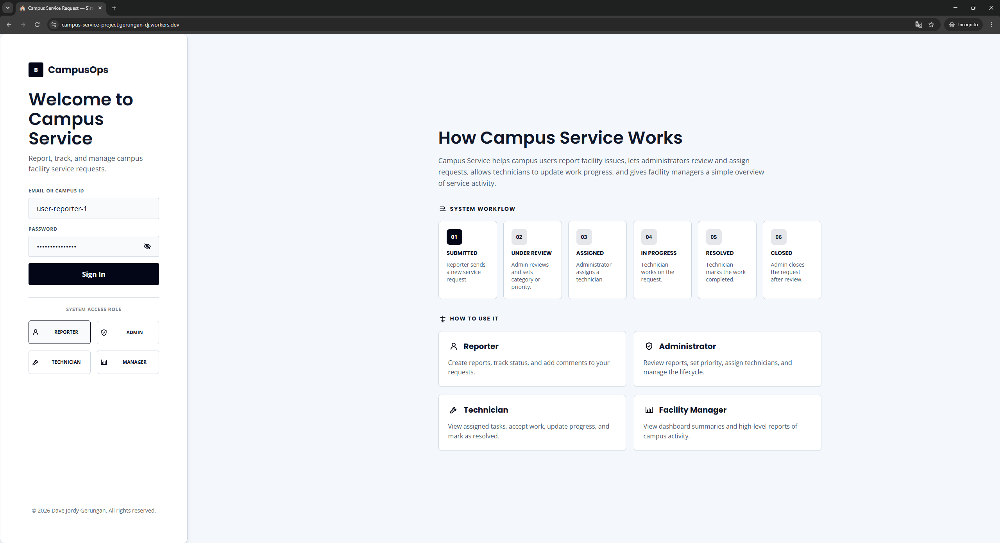
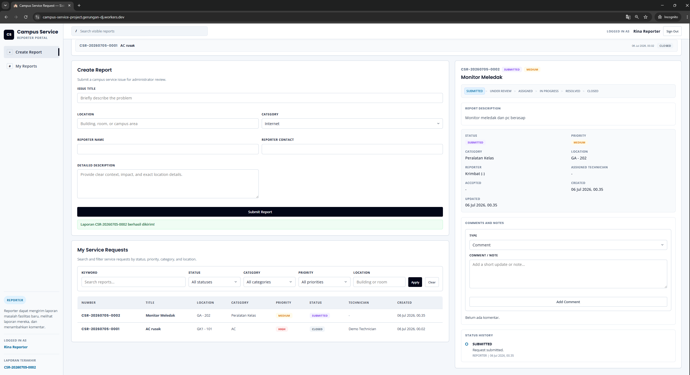
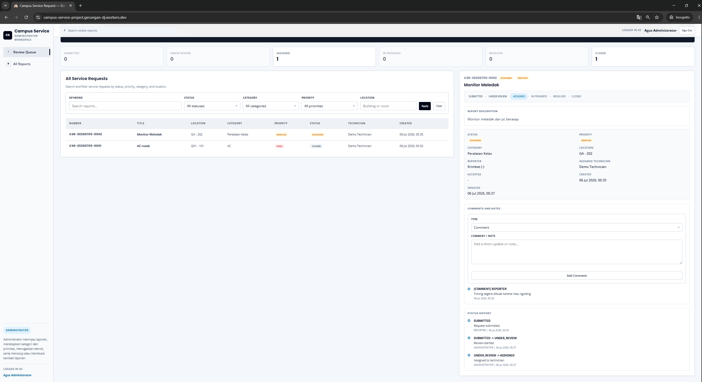
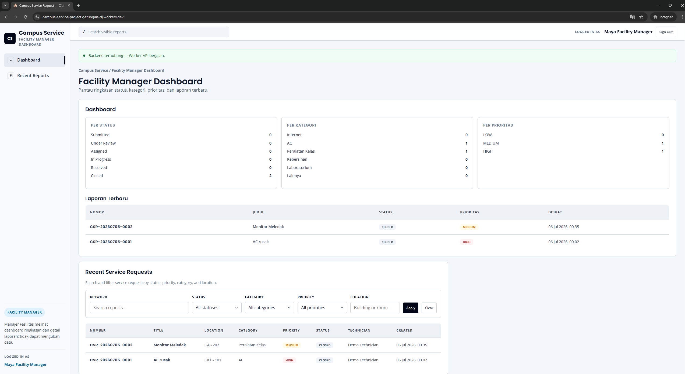

# Campus Service Request and Maintenance System

> Software Engineering final project for reporting, tracking, assigning, resolving, and reviewing campus facility service requests.

[](#project-status)
[](#technology-stack)
[](#technology-stack)
[](#verification)
[](#live-demo)

## Live Demo

| Item | Link / Value |
|---|---|
| Public app | <https://campus-service-project.gerungan-dj.workers.dev> |
| Health check | <https://campus-service-project.gerungan-dj.workers.dev/api/health> |
| Final deployment notes | `docs/deployment/01-deployment-notes.md` |
| Release note | `docs/deployment/02-release-note.md` |

## Project Overview

Campus Service Request and Maintenance System is a role-based campus facility workflow app. It lets campus users submit facility issues, administrators review and assign requests, technicians update work progress, and facility managers monitor summary dashboards.

The required lifecycle is implemented as:

```text
Submitted -> Under Review -> Assigned -> In Progress -> Resolved -> Closed
```

The project includes requirements, design, implementation, tests, Cloudflare deployment evidence, traceability, AI usage evidence, and human review notes.

## Demo Access

The final demo uses seeded educational actors. The password is the same as the actor ID.

| Role | Demo actor ID | Main capability |
|---|---|---|
| Reporter | `user-reporter-1` | Create reports, view status, add comments |
| Administrator | `user-admin-1` | Review, prioritize, assign, close, and reopen reports |
| Technician | `user-tech-1` | View assigned tasks, accept work, update progress |
| Facility Manager | `user-manager-1` | View dashboard summaries and recent reports |

This is a demo login/session mechanism, not production authentication. Google login and paid identity services are intentionally deferred.

## Core Features

| Area | Implemented capability |
|---|---|
| Report intake | Create a new service request with title, location, category, reporter details, and description |
| Report tracking | View request list, search, filter, and open request detail |
| Admin review | Move submitted requests into review, set category and priority, assign technicians |
| Technician workflow | Accept assigned work, mark in progress, and mark resolved |
| Comments and notes | Add append-only comments or notes to visible requests |
| Status history | Store and display lifecycle history for every transition |
| Closure control | Close resolved reports and reopen reports with reason/context |
| Dashboard | Show simple facility manager summaries by status, category, priority, and recent reports |
| Role boundary | Restrict actions by seeded role context for the educational demo |
| Public deployment | Serve React static assets and Worker API from one Cloudflare Worker |

## Screenshots

Final visual evidence is stored in `evidence/Screenshoots/final/`.

<p>
  
  
</p>
<p>
  
  
</p>

Screenshot index:

| File | Evidence |
|---|---|
| `01-login-page.png` | Public login page and seeded demo actor access |
| `02-reporter-create-report.png` | Reporter Create Report form |
| `03-reporter-created-detail.png` | Reporter request creation result and detail panel |
| `04-reporter-comment-history.png` | Reporter comment and status history |
| `05-admin-review-assign.png` | Administrator review and technician assignment |
| `06-technician-progress-resolved.png` | Technician progress and resolved workflow |
| `07-admin-close-reopen.png` | Administrator close/reopen area and lifecycle history |
| `08-manager-dashboard.png` | Facility Manager dashboard |
| `09-health-check.png` | Public `/api/health` endpoint returning `ok` |

## Technology Stack

| Layer | Technology |
|---|---|
| Frontend | React, TypeScript, Vite |
| Backend | Cloudflare Worker |
| Database | Cloudflare D1 / SQLite-compatible schema |
| Tests | Vitest and Cloudflare Workers test tooling |
| Deployment | Cloudflare Workers with Static Assets |
| Version control | GitHub issues, branches, pull requests, and evidence docs |

## Repository Map

```text
skills/             15 project workflow skills
docs/requirements/  Requirements, validation, change requests, traceability
docs/design/        Architecture, database/API, and UI design
docs/planning/      Issue plan, implementation queue, agent protocol
docs/testing/       Test plan, acceptance results, coverage, final audit
docs/deployment/    Cloudflare deployment notes and release note
evidence/           AI evidence, human review notes, screenshots
migrations/         D1 database migration
src/                React TypeScript frontend
worker/             Cloudflare Worker API and domain logic
tests/              Unit and integration tests
public/             Built frontend assets served by the Worker
```

## Requirements Coverage

| Deliverable | Required | Current evidence |
|---|---:|---|
| Project skills | 15 | 15 stage skill directories under `skills/` |
| Functional requirements | 12 minimum | 15 `FR-*` requirements |
| Non-functional requirements | 6 minimum | 7 `NFR-*` requirements |
| Business rules | 5 minimum | 8 `BR-*` rules |
| User stories | 10 minimum | 11 `US-*` stories |
| Acceptance criteria | 2 per story | 22 `AC-*` criteria |
| GitHub Issues | 10 minimum | Issues `#8` to `#19` |
| Pull Requests | 6 minimum | More than 6 merged PRs |
| Automated tests | 20 minimum | 66 tests passed across 16 files |
| Change requests | 1 minimum | `CR-001`, `CR-002`, `CR-003` |
| Public URL | 1 | Cloudflare Worker URL above |
| Traceability | Required | `docs/requirements/traceability.md` |
| AI evidence | Required | `evidence/` |

## Run Locally

Prerequisites:

- Node.js and npm
- Cloudflare Wrangler through project dependencies
- Local Cloudflare/D1 development environment as configured by `wrangler.jsonc`

Install dependencies:

```powershell
npm.cmd install
```

Start the Worker with static assets:

```powershell
npm.cmd run dev
```

Open the local URL printed by Wrangler.

## Verification

Run the same checks used for final readiness:

```powershell
npx.cmd tsc --noEmit
npm.cmd test -- --run
npm.cmd run build:frontend
```

Latest documented final verification:

| Check | Result |
|---|---|
| TypeScript | Passed |
| Automated tests | 66 passed across 16 files |
| Frontend build | Passed |
| Public root HTML | HTTP 200 |
| Public `/api/health` | `{ "data": { "status": "ok" } }` |
| Public login/demo session | Verified |
| Public smoke flow | Verified |

## Deployment

This repository already contains the Cloudflare Worker and Static Assets configuration. Do not create a new Worker or Pages project for final deployment.

Deploy the existing Worker:

```powershell
npm.cmd run deploy
```

Deployment documentation:

- `wrangler.jsonc`
- `docs/deployment/01-deployment-notes.md`
- `docs/deployment/02-release-note.md`

## Documentation Index

| Topic | Start here |
|---|---|
| Requirements | `docs/requirements/03-specification.md` |
| Traceability | `docs/requirements/traceability.md` |
| Architecture | `docs/design/01-architecture.md` |
| Database and API | `docs/design/02-database-api.md` |
| UI design | `docs/design/03-ui.md` |
| Test plan | `docs/testing/01-test-plan.md` |
| Acceptance results | `docs/testing/02-acceptance-test-results.md` |
| Final readiness audit | `docs/testing/final-readiness-audit-2026-07-06.md` |
| Screenshot guide | `docs/testing/03-final-screenshot-guide.md` |
| Deployment notes | `docs/deployment/01-deployment-notes.md` |
| Release note | `docs/deployment/02-release-note.md` |
| AI and human review evidence | `evidence/` |

## Known Limitations

- Demo login/session is an educational seeded actor context, not production authentication.
- Google login, upload photo, email notification, room QR code, AI categorization, spare-part inventory, and vendor management are deferred because they are outside the approved required scope.
- Numeric performance/security NFR targets are deferred because the case material does not define exact measurable targets.
- Retention, deletion, and archive policy are deferred because they were not specified in the case.
- `npm audit` remains a documented known limitation for development/test tooling dependencies. `npm audit fix` was intentionally not run during finalization.

## Project Status

Status: final demo ready with documented limitations.

The implemented system satisfies the approved campus service request workflow, has passing automated verification, is deployed publicly on Cloudflare Workers, includes final screenshot evidence, and keeps requirement-to-design-to-issue-to-code-to-test traceability current.

## Reflection Questions

The assignment reflection questions are in `AI_Assisted_Campus_Service_Project.md`, section `# 5. Pertanyaan Refleksi`.

Questions to answer:

1. Bagian mana yang paling membantu ketika menggunakan AI?
2. Kesalahan apa yang paling sering dibuat AI?
3. Fitur apa yang pernah dibuat AI tetapi tidak terdapat pada requirement?
4. Test apa yang gagal dan apa penyebabnya?
5. Perubahan apa yang dilakukan setelah human review?
6. Mengapa output AI tidak boleh langsung dianggap benar?
7. Bagaimana traceability membantu proyek?
8. Apa yang akan diperbaiki jika proyek diulang?

## Submission Format

```text
Nama: Dave Jordy Gerungan
NIM: [isi NIM]
Kelas: [isi kelas]
Anggota tim: [isi anggota tim atau tulis "Individu"]
Repository URL: https://github.com/Jordyee/campus-service-project
Cloudflare URL: https://campus-service-project.gerungan-dj.workers.dev
Commit terakhir: [isi hash commit terakhir dari branch final saat pengumpulan]
Jumlah test: 66 automated tests across 16 files
AI yang digunakan: OpenAI ChatGPT / Codex
Known limitations:
- Demo login/session uses seeded educational actors, not production authentication.
- Google login, upload photo, email notification, room QR code, AI categorization, spare-part inventory, and vendor management are deferred.
- Numeric performance/security NFR targets are deferred because exact targets were not defined in the case.
- Retention, deletion, and archive policy are deferred because they were not specified in the case.
- npm audit remains a documented known limitation for development/test tooling dependencies; npm audit fix was not run.
```
